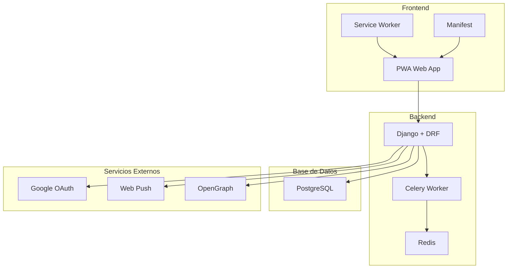
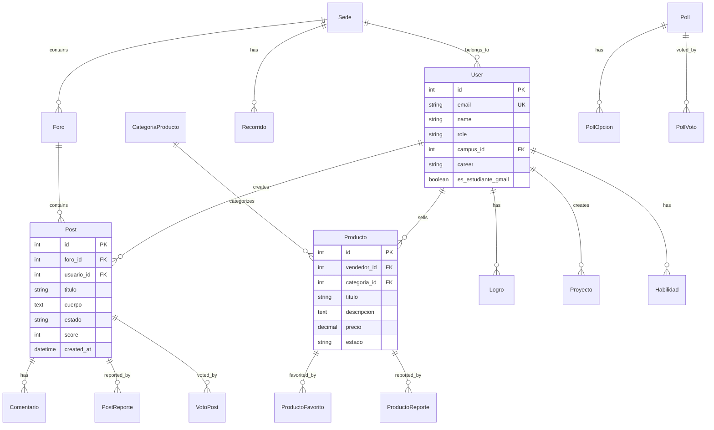
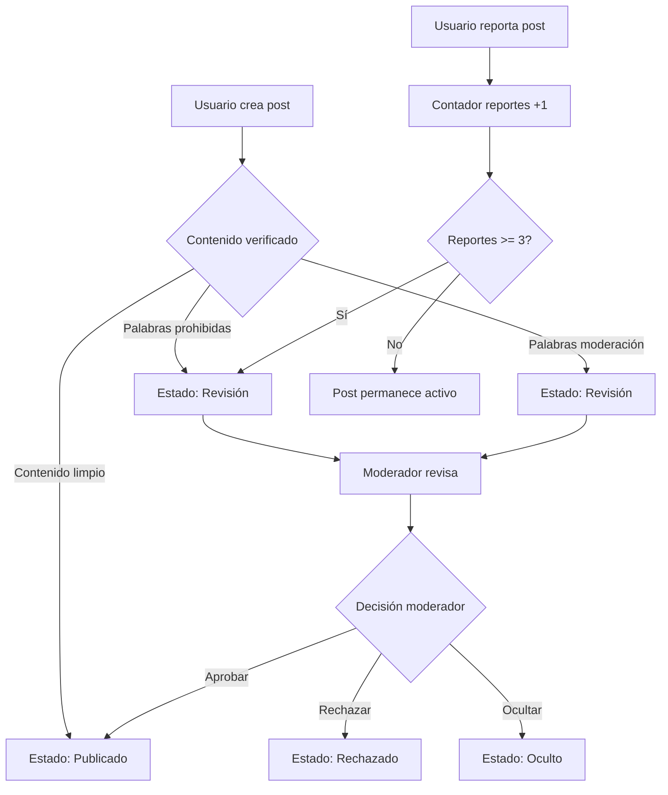
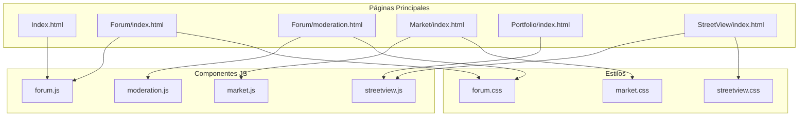
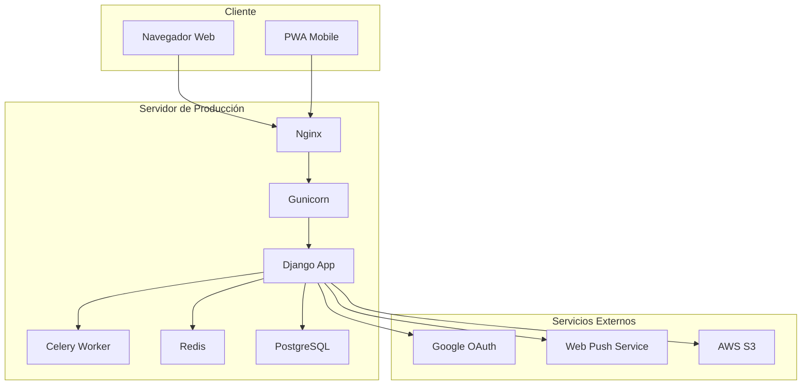
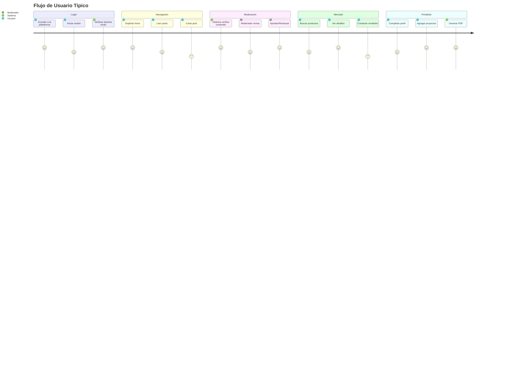

# Diagramas del Sistema - DuocPoint

## Diagrama de Arquitectura General



## Diagrama de Base de Datos



## Diagrama de Flujo de Moderación



## Diagrama de Componentes Frontend



## Diagrama de API REST

```mermaid
graph TB
    subgraph "Autenticación"
        A1[POST /api/auth/login/]
        A2[POST /api/auth/refresh/]
        A3[GET /api/accounts/me/]
    end
    
    subgraph "Foros"
        F1[GET /api/forum/foros/]
        F2[GET /api/forum/posts/]
        F3[POST /api/forum/posts/]
        F4[POST /api/forum/posts/{id}/reportar/]
        F5[POST /api/forum/posts/{id}/moderar/]
    end
    
    subgraph "Mercado"
        M1[GET /api/market/productos/]
        M2[POST /api/market/productos/]
        M3[GET /api/market/categorias/]
    end
    
    subgraph "Portafolio"
        P1[GET /api/portfolio/portafolio-completo/]
        P2[POST /api/portfolio/generar-pdf/]
    end
    
    subgraph "Encuestas"
        E1[GET /api/polls/]
        E2[POST /api/polls/{id}/votar/]
    end
```

## Diagrama de Deployment



## Diagrama de Flujo de Usuario


